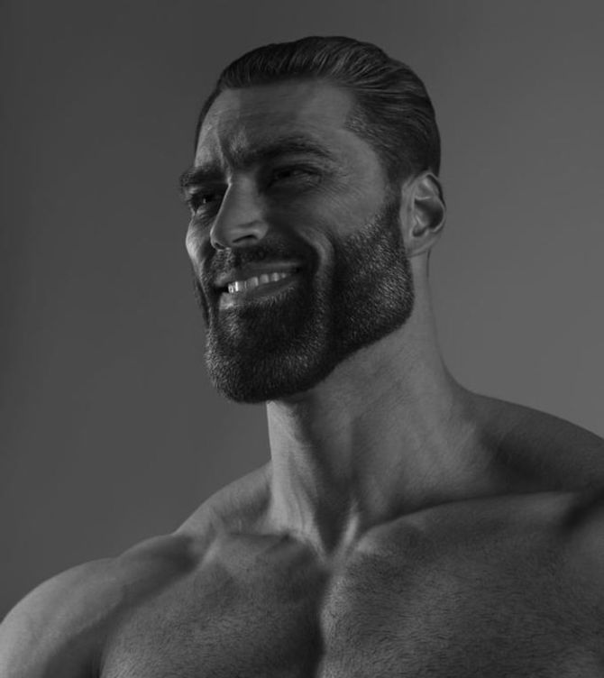
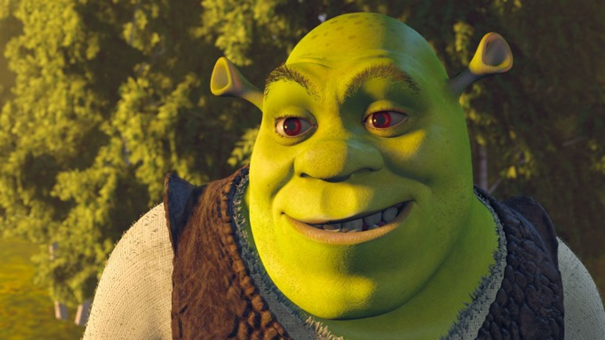

# Image Mixing

Based on [Stable unCLIP](https://github.com/Stability-AI/stablediffusion/blob/main/doc/UNCLIP.MD)

## Требования для запуска

* python >= 3.8
* CUDA >= 11.7

## Quich start

bash ./run.sh path_to_base_img path_to_style_img

## Установка зависимостей

pip install -r requirements.txt

## Инференс

python main.py path_to_base_img path_to_style_img \[--influence\] \[--seed\] \[--noise_level\] \[--num_inference_steps\] \[--guidance_scale\]

--influence(default=0.4) принимает значения в [0, 1], 0 - влияние только Base img, 1 - влияние только Style img

Полученное изображение сохраняется в текущую дерикторию с именем {base_name}_{style_name}.png

## Результаты

base img:

style img:

result:

base img:

style img:

result:
